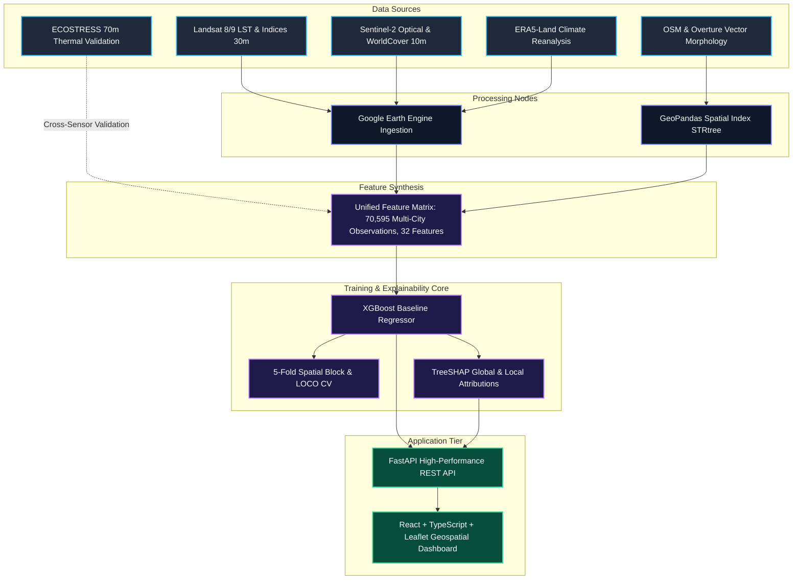
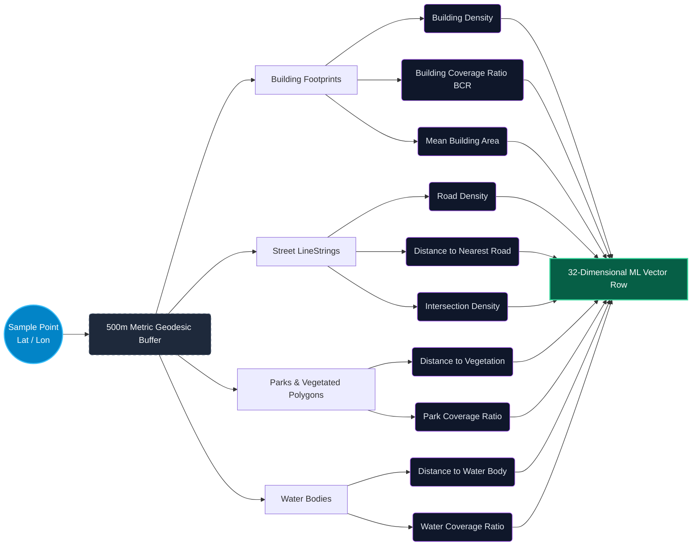
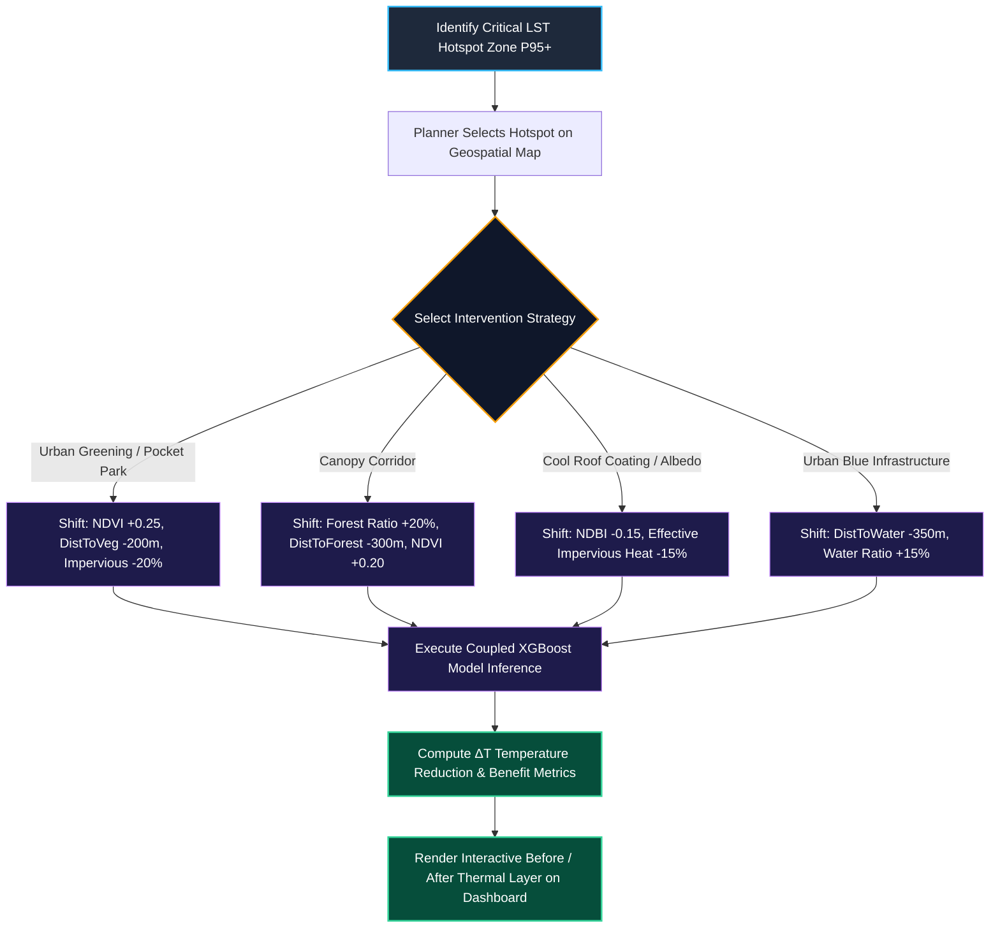

# 🛰️ Geospatial AI/ML Urban Heat Island (UHI) Decision Support System

[](https://www.isro.gov.in/)
[](https://python.org)
[](https://fastapi.tiangolo.com)
[](https://xgboost.readthedocs.io/)
[](https://react.dev)
[](https://www.typescriptlang.org/)
[](https://leafletjs.com/)
[](LICENSE)

An end-to-end geospatial machine learning platform and decision-support system (DSS) designed to identify urban heat stress hotspots, evaluate thermal drivers via explainable AI (TreeSHAP), and simulate location-specific cooling interventions (green roofs, urban canopy corridors, cool pavements, and blue infrastructure) across four diverse Indian metropolitan climates: **Delhi, Bengaluru, Lucknow, and Kanpur**.

---

## 📌 Problem Statement & Core Mission

### ISRO Challenge: *Optimizing Urban Heat Mitigation and Cooling Strategies via AIML*
Rapid urban growth, replacement of natural vegetation with impervious concrete/asphalt, and trapped anthropogenic heat emissions have severely intensified the **Urban Heat Island (UHI)** effect across Indian cities. Traditional municipal responses apply generic, one-size-fits-all cooling measures that fail to address hyper-local microclimates.

### Our Solution
We address this challenge by developing a **geospatial AI/ML-driven Decision Support System backed by physics-informed modeling**:
1. **Multi-Source Geospatial Ingestion**: Integrates satellite thermal telemetry (Landsat 8/9, ECOSTRESS), optical indices (Sentinel-2), climate reanalysis (ERA5-Land), and fine-grained urban morphology (OpenStreetMap, Overture Maps).
2. **Spatial Feature Engineering**: Synthesizes 32 localized spatial indicators across a 500m geodesic buffer (Building Density, Building Coverage Ratio, Road Density, Proximity to Green/Blue Spaces).
3. **Scientifically Validated Machine Learning**: Multi-city baseline regressor ($R^2 = 0.8904$) rigorously tested using **5-Fold Spatial Block Cross-Validation** (to eliminate spatial autocorrelation leakage) and **Leave-One-City-Out (LOCO) CV** (evaluating cross-climate zero-shot transfer).
4. **Explainable AI (TreeSHAP)**: Quantifies the exact temperature contribution ($^\circ\text{C}$) of each built-environment and meteorological factor globally and per hotspot.
5. **Coupled Counterfactual Intervention Simulator**: Evaluates cooling efficiency ($\Delta T$ drop) for simulated interventions, accounting for coupled physical shifts (e.g. increasing canopy coverage simultaneously reduces impervious surface fraction and NDBI).

---

## 🏛️ System Architecture & Dataflow

### 1. End-to-End Pipeline


### 2. Spatial Morphology Feature Extraction (500m Buffer)


### 3. Closed-Loop Counterfactual Policy Simulation Workflow


---

## 🛰️ Geospatial Datasets & Ingestion Pipeline

| Dataset / Source | Sensor / Platform | Spatial Resolution | Extracted Features & Role |
| :--- | :--- | :--- | :--- |
| **Landsat 8/9 (TIRS & OLI)** | USGS / NASA | 30m | Land Surface Temperature (LST - Target), NDVI, NDBI, NDWI |
| **Sentinel-2 (MSI)** | ESA Copernicus | 10m / 20m | High-Resolution Surface Reflectance, S2_NDVI, QA60 Cloud Mask |
| **ECOSTRESS** | ISS Radiometer | 70m | ECO_L2T_LSTE v003 Thermal Validation Scene (ISS orbital swath) |
| **ESA WorldCover** | Sentinel-1/2 Composite | 10m | Land Use / Land Cover (LULC) 11-class categorizations |
| **ERA5-Land** | ECMWF Reanalysis | 0.1° (~9 km) | 2m Air Temperature, Relative Humidity, 10m Wind Speed |
| **OpenStreetMap & Overture** | Open Community / Meta | Vector Polygons | Building footprints (1.55M in BLR), Street lines, Parks, Water |
| **GHSL (Built-up Grid)** | European Commission | 100m | Global Human Settlement Layer built-up surface probability |
| **SRTM DEM** | NASA Shuttle Radar | 30m | Digital Elevation Model (Topography / Terrain elevation) |

### Scientific Considerations & Sensor Harmonization
1. **Sentinel-2 QA60 Cloud Masking**: In Google Earth Engine (`gee/statedatasset.js`), cirrus and opaque cloud flags (`QA60` bits 10 and 11) are filtered to preserve clear-sky pixels during the summer heat peak window.
2. **ECOSTRESS 70m vs Landsat 8/9 Harmonization**:
   - The International Space Station (ISS) operates on a precessing, non-sun-synchronous orbit, capturing diurnal variations at irregular repeat intervals.
   - For 2024, consistent Landsat 8/9 passes are available across Delhi, Kanpur, Lucknow, and Bengaluru, providing our primary harmonized multi-city training dataset (70,595 observations).
   - The 2019 Bengaluru ECOSTRESS pass (26 granules) was used as a high-resolution 70-meter benchmark to validate that our model's learned microclimate gradients mirror true radiometric skin temperatures.

---

## 📐 Urban Morphology Mathematical Formulations

To capture how 3D urban geometry traps radiative energy, all vector infrastructures within a **500m geodesic metric buffer** around each sample point are converted into continuous numerical indicators using high-speed `shapely.STRtree` spatial indexing:

1. **Building Coverage Ratio ($BCR$)**:
   $$BCR = \frac{\sum_{i \in \mathcal{B}} \text{Area}(b_i \cap \Omega)}{\text{Area}(\Omega)} \times 100$$
   where $\Omega$ is the 500m circular buffer and $\mathcal{B}$ represents intersecting building polygons.
2. **Building Density**:
   $$\text{Building Density} = |\mathcal{B} \cap \Omega|$$
3. **Road Density**:
   $$\text{Road Density} = \frac{\sum_{j \in \mathcal{R}} \text{Length}(r_j \cap \Omega)}{\text{Area}(\Omega)} \quad (\text{m} / \text{m}^2)$$
4. **Distance to Nearest Infrastructure**:
   $$\text{DistToFeature}(p) = \min_{k \in \mathcal{F}} \text{EuclideanDistance}(p, f_k) \quad \forall \mathcal{F} \in \{\text{Roads}, \text{Vegetation}, \text{Water}, \text{Parks}\}$$
5. **Intersection Density**:
   $$\text{Intersection Density} = \frac{\text{Count of Road Junction Nodes inside } \Omega}{\text{Area}(\Omega)}$$

---

## 📊 Scientific Benchmarks & Model Evaluation

Our models are trained on the consolidated master dataset of **70,595 multi-city observations** with 32 clean, non-null features.

### 1. Cross-Validation Benchmarks

```
========================================================================================
Evaluation Protocol                       R² Score         RMSE (°C)        MAE (°C)
========================================================================================
1. Baseline Stratified Split (80 / 20)    0.8904           1.4960           1.1296
2. 5-Fold Spatial Block CV (4x4 Grid)     0.7919 ± 0.0351  2.0035 ± 0.1904  1.5166 ± 0.1366
3. Leave-One-City-Out (LOCO) Transfer     0.5916 ± 0.0618  2.7433 ± 0.4741  2.1154 ± 0.3111
========================================================================================
```

> [!IMPORTANT]
> **Defeating Spatial Autocorrelation Leakage**:
> Standard random splits often overestimate model performance on geospatial data due to spatial autocorrelation (Tobler's First Law). Our **5-Fold Spatial Block CV** divides each city into contiguous $4 \times 4$ spatial blocks (GroupKFold), guaranteeing that training and testing partitions are spatially disjoint.

#### 5-Fold Spatial Block Results
* **Fold 1**: $R^2 = 0.7985 \quad | \quad \text{RMSE} = 2.3073^\circ\text{C} \quad | \quad \text{MAE} = 1.7695^\circ\text{C}$
* **Fold 2**: $R^2 = 0.8197 \quad | \quad \text{RMSE} = 1.8254^\circ\text{C} \quad | \quad \text{MAE} = 1.4033^\circ\text{C}$
* **Fold 3**: $R^2 = 0.7956 \quad | \quad \text{RMSE} = 2.1401^\circ\text{C} \quad | \quad \text{MAE} = 1.5466^\circ\text{C}$
* **Fold 4**: $R^2 = 0.8209 \quad | \quad \text{RMSE} = 1.8263^\circ\text{C} \quad | \quad \text{MAE} = 1.4070^\circ\text{C}$
* **Fold 5**: $R^2 = 0.7248 \quad | \quad \text{RMSE} = 1.9184^\circ\text{C} \quad | \quad \text{MAE} = 1.4567^\circ\text{C}$

#### Leave-One-City-Out (Zero-Shot Cross-Climate Transfer)
* **Kanpur** (Tested on Delhi + Lucknow + Bengaluru): $R^2 = 0.6617 \quad | \quad \text{RMSE} = 2.3695^\circ\text{C}$
* **Delhi** (Tested on Kanpur + Lucknow + Bengaluru): $R^2 = 0.6441 \quad | \quad \text{RMSE} = 2.9299^\circ\text{C}$
* **Lucknow** (Tested on Delhi + Kanpur + Bengaluru): $R^2 = 0.5364 \quad | \quad \text{RMSE} = 2.2423^\circ\text{C}$
* **Bengaluru** (Tested on Delhi + Kanpur + Lucknow): $R^2 = 0.5242 \quad | \quad \text{RMSE} = 3.4313^\circ\text{C}$

---

## 🔍 Explainable AI (TreeSHAP) & Key Thermal Drivers

Using **TreeSHAP**, we break down the model from a black box into actionable physics-backed attributions.

### Global Feature Attributions

| Rank | Feature Name | Mean Absolute SHAP ($^\circ\text{C}$) | Relative Contribution (%) | Thermal Impact Mechanism |
| :---: | :--- | :---: | :---: | :--- |
| **1** | **NDBI** (Built-up Index) | **$1.731^\circ\text{C}$** | **$29.15\%$** | Solar radiation absorption by concrete, brick & roof tiles |
| **2** | **LULC Class** | **$0.665^\circ\text{C}$** | **$11.20\%$** | Surface cover category (impervious vs vegetative vs bare) |
| **3** | **NDWI** (Water Index) | **$0.650^\circ\text{C}$** | **$10.95\%$** | Evaporative cooling deficit in dry soil/impervious zones |
| **4** | **DistToVeg** (Distance to Vegetation) | **$0.519^\circ\text{C}$** | **$8.74\%$** | Proximity loss to evapotranspiration cooling buffers |
| **5** | **Distance_to_Road** | **$0.378^\circ\text{C}$** | **$6.37\%$** | Asphalt thermal inertia and proximity to vehicular heat |
| **6** | **RH** (Relative Humidity) | **$0.346^\circ\text{C}$** | **$5.83\%$** | Atmospheric moisture suppressing latent heat dissipation |
| **7** | **AirTemp** (ERA5 2m) | **$0.262^\circ\text{C}$** | **$4.41\%$** | Ambient convective background temperature |
| **8** | **Distance_to_Water** | **$0.193^\circ\text{C}$** | **$3.26\%$** | Microclimatic lake/river cooling buffer radius |
| **9** | **NDVI** (Vegetation Index) | **$0.190^\circ\text{C}$** | **$3.19\%$** | Canopy shading and active transpiration cooling |
| **10** | **GHSL Built-Up Grid** | **$0.139^\circ\text{C}$** | **$2.35\%$** | Macro-scale urban fabric continuity |
| **11** | **Distance_to_Park** | **$0.138^\circ\text{C}$** | **$2.33\%$** | Proximity to organized recreational green infrastructure |
| **12** | **DEM** (Elevation) | **$0.120^\circ\text{C}$** | **$2.02\%$** | Adiabatic lapse rate and regional terrain elevation |
| **13** | **Water_Coverage_Ratio** | **$0.109^\circ\text{C}$** | **$1.84\%$** | Blue surface fraction inside 500m buffer |
| **14** | **WindSpeed** | **$0.102^\circ\text{C}$** | **$1.72\%$** | Convective heat ventilation along street corridors |
| **15** | **Building_Density** | **$0.054^\circ\text{C}$** | **$0.91\%$** | Sky view factor restriction and radiative entrapment |

---

## 🎯 Hotspot Discovery & Relative Percentile Classification

Hotspots are categorized relative to **city-specific LST distributions** rather than a single fixed national threshold. This ensures local climatic relevance (e.g. $38^\circ\text{C}$ in Bengaluru represents extreme localized heat, whereas in Delhi summer it represents baseline ambient temperatures):

* **Moderate Heat Stress**: $\text{P75} \le \text{LST} < \text{P90}$
* **High Heat Stress**: $\text{P90} \le \text{LST} < \text{P95}$
* **Severe Heat Stress**: $\text{P95} \le \text{LST} < \text{P99}$
* **Critical Heat Stress**: $\text{LST} \ge \text{P99}$

The dashboard exposes:
- **Complete Thermal Point Field** (`GET /api/thermal-field`): Renders all 70,595 observations color-mapped by absolute LST.
- **Percentile Hotspot Overlay** (`GET /api/hotspots`): Highlights the top 25% thermal anomalies with targeted intervention recommendations.

---

## 🌲 Counterfactual Mitigation Strategies

The DSS allows urban planners to simulate four coupled physical interventions with real-time feedback on expected cooling ($\Delta T$):

1. **Urban Greening & Pocket Parks**:
   - $\text{NDVI} \uparrow$ (+0.10 to +0.30)
   - $\text{DistToVeg} \downarrow$ (-50m to -250m)
   - $\text{Park Coverage Ratio} \uparrow$ (+5% to +25%)
   - $\text{Impervious Surface Ratio} \downarrow$ (-5% to -25%)
   - **Average Cooling Impact**: $-1.2^\circ\text{C}$ to $-2.8^\circ\text{C}$
2. **Urban Canopy Corridors**:
   - Continuous linear tree plantings along primary transit corridors.
   - $\text{Forest Coverage Ratio} \uparrow$ (+10% to +20%)
   - $\text{Distance to Forest} \downarrow$ (-100m to -400m)
   - **Average Cooling Impact**: $-0.8^\circ\text{C}$ to $-2.1^\circ\text{C}$
3. **Cool Roof Coatings & High-Albedo Surfaces**:
   - Reflective coatings on large commercial, industrial, and tin roofs.
   - $\text{NDBI} \downarrow$ (-0.05 to -0.20)
   - Effective thermal load $\downarrow$ (-15%)
   - **Average Cooling Impact**: $-0.6^\circ\text{C}$ to $-1.7^\circ\text{C}$
4. **Blue Infrastructure (Retention Ponds & Bio-Swales)**:
   - $\text{Distance to Water} \downarrow$ (-100m to -350m)
   - $\text{Water Coverage Ratio} \uparrow$ (+5% to +15%)
   - **Average Cooling Impact**: $-1.0^\circ\text{C}$ to $-2.3^\circ\text{C}$

---

## 💻 Full-Stack Decision Support Dashboard

The repository includes a modern, high-performance web dashboard designed for urban planners, municipal authorities, and researchers:

* **Regional Overview**: Real-time KPI cards, thermal distribution histograms, and active hotspot summaries.
* **Geospatial Canvas Heatmap**: Fast Leaflet map rendering tens of thousands of thermal observations without lag.
* **Hotspot Inspector**: Click any point on the map to inspect its exact 32-feature profile, local SHAP drivers, and priority score.
* **Interactive Counterfactual Simulator**: Adjust intervention intensity sliders (Greening, Cool Roofs, Parks) and immediately see the predicted temperature reduction.
* **Model Transparency & Validator**: Live interactive charts showing Spatial Block CV folds, residuals, and LOCO performance.
* **Driver Analytics View**: Detailed global and city-specific SHAP bar charts and feature correlation plots.

---

## 📁 Repository Structure

```
urban_heat_mitigation/
├── .gitignore                             # Ignores large datasets, caches, PDFs, and note scratchpads
├── README.md                              # Master project documentation
├── Final_ML_Dataset_With_Morphology.csv   # Consolidated master dataset (70,595 rows, 32 features)
├── Merged_ML_Dataset.csv                  # Pre-morphology intermediate tabular dataset
│
├── gee/                                   # Google Earth Engine telemetry scripts
│   └── statedatasset.js                   # Landsat 8/9, Sentinel-2, ERA5, and LULC extraction script
│
├── ml/                                    # Machine learning training & geospatial pipelines
│   ├── computemorphologyfeature.py        # STRtree spatial buffer join for OSM/Overture buildings & roads
│   ├── get_osm_data.py                    # OSM Overpass API vector extractor
│   ├── train_xgboost.py                   # Baseline XGBoost regressor training script
│   ├── spatial_validation.py              # 5-Fold Spatial Block CV & Leave-One-City-Out validation engine
│   ├── shap_explainability.py             # Global and local TreeSHAP attribution generator
│   ├── generate_hotspots.py               # City-relative percentile anomaly extractor (P75+)
│   ├── csvmerge.py                        # Dataset merging and cleaning utility
│   ├── comparecsv.py                      # Dataset schema comparison utility
│   ├── hotspots.geojson                   # 17,655 curated thermal hotspot anomalies
│   └── models/                            # Serialized model weights (.json), metrics, and SHAP plots
│       ├── xgboost_lst_model.json
│       ├── spatial_validation_results.json
│       ├── feature_importance.csv
│       └── shap/                          # SHAP summary plots and attribution CSVs
│
├── backend/                               # FastAPI inference & simulation backend service
│   ├── requirements.txt                   # Backend dependencies (fastapi, uvicorn, xgboost, pandas, numpy)
│   ├── README.md                          # Backend quickstart guide
│   ├── verify_backend.py                  # Automated test suite for backend API routes
│   └── app/
│       ├── __init__.py
│       ├── main.py                        # REST API with prediction, hotspot, and simulation endpoints
│       ├── models/                        # Production model artifact directory
│       └── datasetcsv/                    # City-level dataset CSVs and GeoJSON caches
│
└── frontend/                              # Interactive geospatial React dashboard
    ├── package.json                       # Dependencies (react, vite, leaflet, lucide-react, etc.)
    ├── vite.config.ts                     # Dev server proxy configuration (/api -> :8000)
    ├── index.html                         # Application entrypoint
    └── src/
        ├── App.tsx                        # Main dashboard container & view switcher
        ├── index.css                      # Modern dark-theme styling & responsive design tokens
        ├── components/                    # UI Views and specialized panels
        │   ├── OverviewView.tsx           # City KPIs, thermal summary cards, and regional stats
        │   ├── HeatMapView.tsx            # Leaflet map rendering thermal point field & hotspots
        │   ├── SimulatorView.tsx          # Real-time counterfactual intervention playground
        │   ├── HotspotExplorer.tsx        # Filterable hotspot list with search & severity sorting
        │   ├── HotspotDetailsModal.tsx    # Modal displaying local SHAP drivers & intervention recommendations
        │   ├── ModelValidator.tsx         # Visual Spatial Block CV and LOCO validation explorer
        │   ├── DriverAnalysis.tsx         # Global SHAP factor attribution breakdown
        │   ├── FeatureLayersView.tsx      # Multi-layer GIS toggling (NDVI, NDBI, DEM, LULC)
        │   ├── SidebarNav.tsx             # Clean navigation sidebar
        │   └── MetricsGrid.tsx            # Live sensor and weather metrics grid
        └── simulation/                    # API integration service & TypeScript interfaces
            ├── apiService.ts              # Typed Axios/Fetch client for backend communication
            ├── types.ts                   # Domain models for hotspots, cells, and interventions
            └── thermalScale.ts            # Scientifically calibrated thermal colormaps
```

---

## 🚀 Quickstart & Reproduction Guide

### Prerequisites
* Python 3.10 or higher
* Node.js 18+ and npm
* Git

---

### 1. Clone the Repository
```bash
git clone https://github.com/cs1m2414238/urban_heat_mitigation.git
cd urban_heat_mitigation
```

---

### 2. Backend Setup & API Launch
```bash
cd backend

# Create and activate a virtual environment
python -m venv venv
# On Windows:
.\venv\Scripts\activate
# On Linux/macOS:
source venv/bin/activate

# Install dependencies
pip install -r requirements.txt

# Verify backend health and run automated test suite
python verify_backend.py

# Launch FastAPI server
python -m uvicorn app.main:app --reload --port 8000
```
* Interactive API Documentation (Swagger UI): [http://localhost:8000/docs](http://localhost:8000/docs)
* Health Check Endpoint: [http://localhost:8000/api/model/metrics](http://localhost:8000/api/model/metrics)

---

### 3. Frontend Dashboard Launch
In a second terminal:
```bash
cd frontend

# Install Node modules
npm install

# Start Vite dev server
npm run dev
```
* Open your browser and navigate to: **[http://localhost:5173](http://localhost:5173)**

---

### 4. Running the Machine Learning Pipeline (Optional)
To retrain or re-validate models from source data:
```bash
cd ml

# 1. Train baseline XGBoost regressor
python train_xgboost.py

# 2. Run 5-Fold Spatial Block CV and Leave-One-City-Out validation
python spatial_validation.py

# 3. Compute TreeSHAP explainability attributions and dependence plots
python shap_explainability.py

# 4. Generate city-relative P75+ hotspot GeoJSON
python generate_hotspots.py
```

---

## 🔬 Scientific Disclaimers & Future Roadmap

* **Heuristic Screening vs Micro-Physics CFD**: The interventions evaluated by our XGBoost model are data-driven counterfactual estimates based on multi-variable feature coupling. They serve as rapid, cost-effective spatial screening tools for municipal planners, providing directional guidance prior to computationally intensive computational fluid dynamics (CFD) simulations (e.g. ENVI-met or SOLWEIG solar radiation modeling).
* **Future Work**:
  * Direct coupling with the **SOLWEIG** solar radiation and mean radiant temperature ($T_{\text{mrt}}$) model.
  * InVEST Urban Cooling Model integration for economic valuation of heat-related ecosystem services.
  * Native automated tree-species selection tool matching native Indian biodiversity (e.g. *Azadirachta indica*, *Pongamia pinnata*) to local soil and moisture regimes.

---

## 📄 License
This project is open-source and licensed under the [MIT License](LICENSE).
